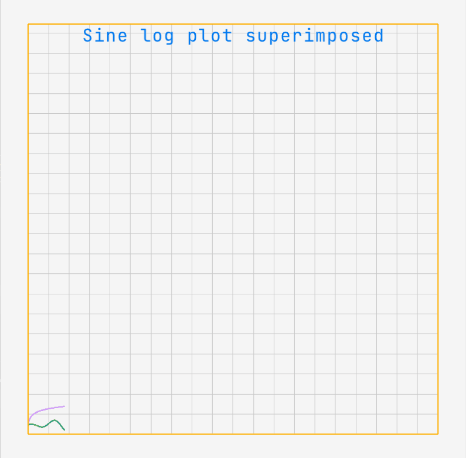

# visualize
A GPU-powered plotting library written in C for Windows, Linux, and macOS (untested).

The initial usage of library is for the [grazie](https://github.com/khisr0w/grazie) deep learning library, in or order to be used for plotting results from deep learning models.

NOTE: The project is in very early stages and due for an architectural change.

